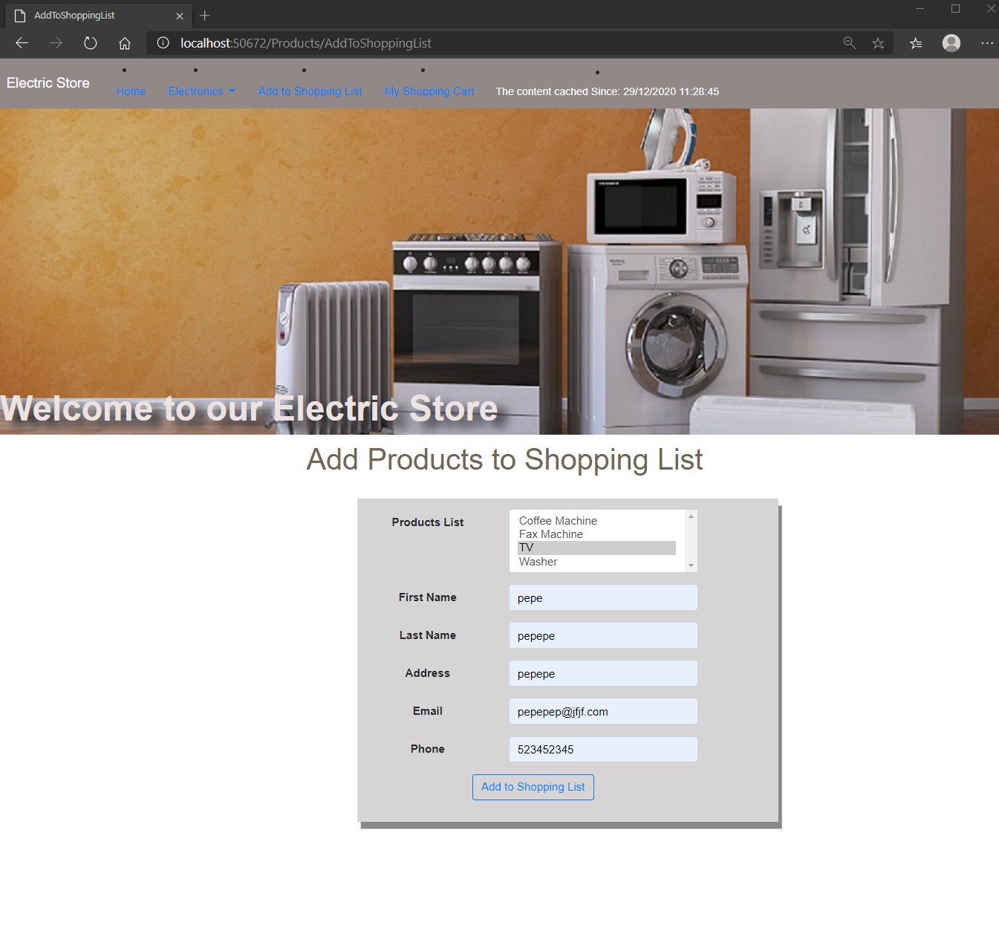
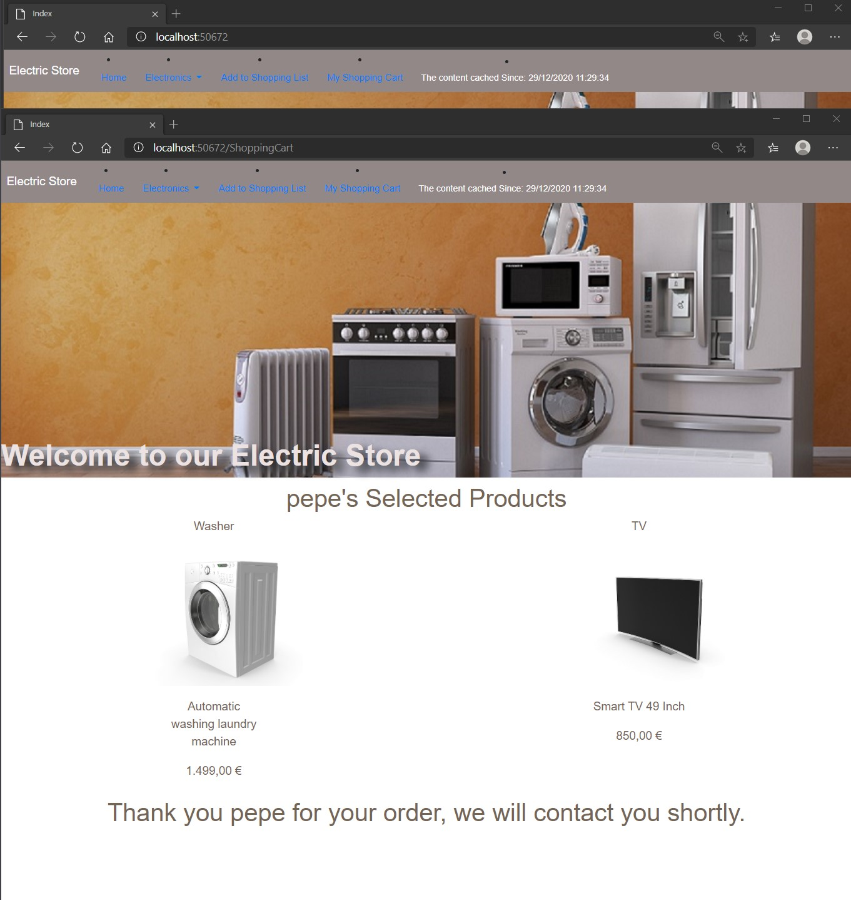

# Module 12: Performance and Communication

## Lab: Performance and Communication

1. **Nombres y apellidos:** Francisco Javier Moreno Quevedo
2. **Fecha:** 02/12/2020
3. **Resumen del Ejercicio:** implementar el uso de la sesión en el proyecto
4. **Dificultad o problemas presentados y como se resolvieron:** Ninguna

Ejercicio 2: Managing State

- En el middleware añadimos el uso de la sesion

- En el **ProductsController.cs** almacenamos la sesion en el post **AddToShoppingListPost**

- En el **ProductsController.cs** devolvemos la sesion en el get **AddToShoppingList**

- En el **ShoppingCartController.cs** añadimos el constructor y en el index la lista de productos seleccionados

- Ejecutamos y comprobamos que desde otra ventana recuperamos los productos comprados

  

